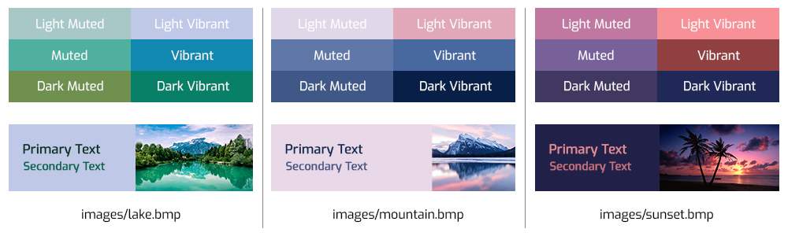

# Splash 

A C++ port of Android's Palette API with some bonus features!



## Building

Simply run the 'library' target by executing (requires a C++11 compatible compiler):

```bash
make library -j$(nproc)
```

This will use the optimal number of threads to compile the library.

**Tip: Running `make` without a target will list the available targets with a description of what they do.**

## Usage

**See the example for a complete explanation of how to use this library.**

### Compiler Flags

You will need to include the library's include directory by passing the following flag to the compiler:

```bash
-I/path/to/include
```

You will also need to link against the compiled binary by passing the following flags:

```bash
-L/path/to/lib -lSplash
```

### Code

Make sure you include the splash header:

```cpp
#include "splash/Splash.hpp"
```

Create and fill a `Splash::Bitmap`:

```cpp
// Create a 400px x 400px image
Splash::Bitmap image = Splash::Bitmap(400, 400);

// Provide a vector of Splash::Colour (pixels) to fill the bitmap
std::vector<Splash::Colour> pixels = ...;
image.setPixels(pixels, 0, 0, image.getWidth(), image.getHeight());
```

To create a Palette and get the generated Swatches:

```cpp
// This creates a Splash::Palette::Builder and immediately calls generate() to return a Palette
std::shared_ptr<Splash::Palette> palette = Splash::Palette::from(image).generate();

// Each of these methods return the associated Swatch
Splash::Swatch swatch;
swatch = palette->getDominantSwatch();
swatch = palette->getDarkMutedSwatch();
swatch = palette->getDarkVibrantSwatch();
swatch = palette->getLightMutedSwatch();
swatch = palette->getLightVibrantSwatch();
swatch = palette->getVibrantSwatch();
swatch = palette->getMutedSwatch();

// You should check that the returned swatch is valid as a swatch is not always generated
if (swatch.isValid()) {
    // Print out the values of the swatch
    std::cout << swatch.toString() << std::endl;
}
```

For more information on how to use and customize the generated swatches, see the [Android reference](https://developer.android.com/reference/androidx/palette/graphics/Palette) for available methods (the syntax is nearly identical)

### Bonus: MediaStyle Colours

The MediaStyle object returns colours that are used in Android's media notifications:

```cpp
// Create the MediaStyle object from a Splash::Bitmap
Splash::MediaStyle style = Splash::MediaStyle(image);

// Returns whether the background is light or dark
bool isLight = style.isLight();

// Each of these methods returns suitable colours to use together
// They should always be readable, no matter what input image is used
Splash::Colour colour;
colour = style.getBackgroundColour();
colour = style.getPrimaryTextColour();
colour = style.getSecondaryTextColour();
```

## Testing

**The tests currently only test my additional classes, and not the ported sections of code.**

To compile the tests run:

```bash
make tests
```

To run (and if needed compile) the tests:

```bash
make run-tests
```

## Acknowledgements

Thanks to:

* [ArashPartow](https://github.com/ArashPartow) for the [bitmap_image](https://github.com/ArashPartow/bitmap) library (used in the example to load .bmp images)
* [catchorg](https://github.com/catchorg) for the [Catch2](https://github.com/catchorg/Catch2) testing framework
* Google for the [original library](https://android.googlesource.com/platform/frameworks/support/+/refs/heads/androidx-master-dev/palette/palette/src/main/java/androidx/palette/graphics)
